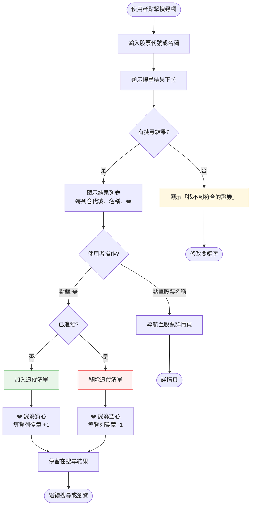
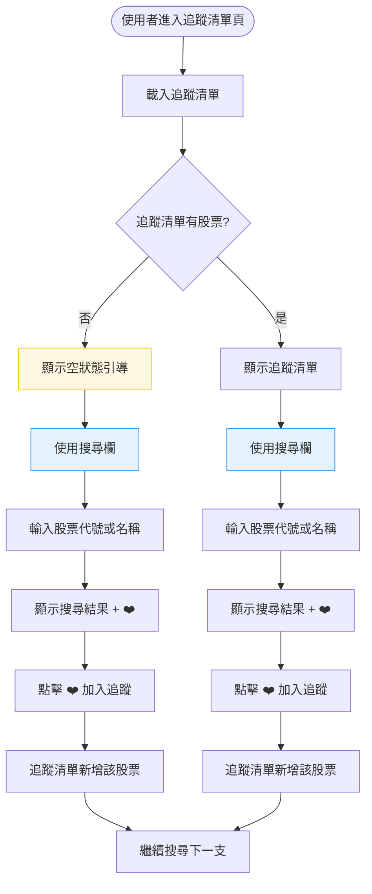

# 追蹤任意股票 — 操作流程設計

> **功能名稱**：追蹤任意股票（含尚未公布配息的股票）
> **核心價值**：讓使用者從搜尋結果直接加入追蹤，無需跳頁，追蹤清單頁也能直接搜尋加入
> **改善動機**：現行加入追蹤需「搜尋 → 跳頁 → 點愛心」三步，使用者期望一步完成

---

## 1. 功能概述

讓使用者在搜尋結果中直接點擊 ❤️ 加入追蹤，並在追蹤清單頁提供獨立搜尋欄，支援追蹤尚未公布配息的股票。

---

## 2. 使用者與場景

### 使用者角色

| 角色 | 說明 |
|------|------|
| 一般使用者 | 訪客即可使用，無需登入，資料儲存於瀏覽器 |

### 觸發入口

| 入口 | 位置 | 說明 |
|------|------|------|
| 🔍 搜尋欄 + ❤️ | 導覽列搜尋結果下拉 | 搜尋結果每列右侧新增 ❤️ 按鈕 |
| 🔍 搜尋欄 + ❤️ | 追蹤清單頁面頂部 | 追蹤清單頁專屬搜尋欄，結果含 ❤️ 按鈕 |
| ❤️ 追蹤按鈕 | 股票詳情頁（既有望） | 維持不變 |

### 前置條件

- ☐ 無（開放所有人使用）

### 使用情境

| 情境 | 說明 |
|------|------|
| 從導覽列搜尋快速追蹤 | 使用者搜尋股票，直接在下拉結果中點擊 ❤️ 加入 |
| 從追蹤清單頁搜尋加入 | 使用者在追蹤清單頁面，透過搜尋欄找到股票並加入 |
| 追蹤尚未公布配息的股票 | 使用者追蹤的股票不在 upcoming.json 中，追蹤清單顯示「無近期配息」 |
| 從股票詳情頁追蹤（既有望） | 使用者在詳情頁點擊 ❤️，流程不變 |

---

## 3. 操作流程圖

### 主流程：搜尋結果直接加入追蹤

### 主流程：追蹤清單頁搜尋加入

---

## 4. 逐步互動說明

### 步驟 1：從導覽列搜尋結果加入追蹤

| | 描述 |
|---|------|
| **觸發** | 使用者在導覽列搜尋欄輸入股票代號或名稱 |
| **操作前** | 搜尋結果下拉僅顯示代號與名稱，無 ❤️ 按鈕 |
| **系統回應** | 顯示搜尋結果下拉，每列右侧新增小型 ❤️ 按鈕（空心） |
| **操作後** | 搜尋結果含可互動的追蹤按鈕 |
| **下一步** | 步驟 1a：點擊 ❤️ 加入追蹤，或點擊股票名稱查看详情 |

### 步驟 1a：點擊 ❤️ 加入追蹤

| | 描述 |
|---|------|
| **觸發** | 使用者在搜尋結果中點擊 ❤️ 按鈕 |
| **操作前** | ❤️ 為空心（未追蹤），導覽列徽章顯示目前數量 |
| **系統回應** | ❤️ 變為實心紅色，導覽列徽章 +1，資料存入 localStorage |
| **操作後** | 該股票已加入追蹤清單，搜尋結果保持顯示 |
| **下一步** | 繼續搜尋下一支股票，或關閉搜尋下拉 |

### 步驟 2：從追蹤清單頁搜尋加入追蹤

| | 描述 |
|---|------|
| **觸發** | 使用者在追蹤清單頁面，點擊頂部搜尋欄 |
| **操作前** | 追蹤清單頁面已載入（含空狀態引導或追蹤列表） |
| **系統回應** | 顯示搜尋欄，輸入後即時顯示搜尋結果下拉（含 ❤️ 按鈕） |
| **操作後** | 搜尋結果顯示符合的股票 |
| **下一步** | 步驟 2a：點擊 ❤️ 加入追蹤 |

### 步驟 2a：點擊 ❤️ 加入追蹤

| | 描述 |
|---|------|
| **觸發** | 使用者在搜尋結果中點擊 ❤️ 按鈕 |
| **操作前** | ❤️ 為空心（未追蹤） |
| **系統回應** | ❤️ 變為實心紅色，導覽列徽章 +1，追蹤清單立即更新 |
| **操作後** | 該股票出現在追蹤清單中（若無配息資料顯示「無近期配息」） |
| **下一步** | 搜尋欄清空，可繼續搜尋下一支 |

### 步驟 3：追蹤尚未公布配息的股票

| | 描述 |
|---|------|
| **觸發** | 使用者追蹤一支不在 upcoming.json 中的股票 |
| **操作前** | 該股票無配息公告資料 |
| **系統回應** | ❤️ 變為實心，追蹤清單新增該股票 |
| **操作後** | 追蹤清單顯示該股票，配息欄位顯示「無近期配息」 |
| **下一步** | 當該股票公布配息後，下次資料更新時自動顯示配息資訊 |

---

## 5. 異常處理

| 異常情境 | 使用者看到的回饋 | 恢復路徑 |
|----------|-----------------|----------|
| 搜尋欄為空 | 不顯示搜尋結果下拉 | 輸入至少一個字元 |
| 搜尋無結果 | 顯示「找不到符合的證券」提示 | 修改搜尋關鍵字 |
| localStorage 不可用 | 追蹤操作正常執行，關閉瀏覽器後資料消失 | 屬於預期行為（隱私模式） |
| 追蹤股票已下市 | 追蹤清單仍顯示該股票，配息顯示「無近期配息」 | 使用者手動移除 |
| 搜尋結果下拉遮擋內容 | 點擊外部或按 Escape 關閉下拉 | 自動處理 |

---

## 6. 邊界與限制

| 項目 | 說明 |
|------|------|
| 追蹤數量上限 | 無硬性限制，建議不超過 100 支 |
| 多裝置同步 | 不支援，每台裝置獨立 |
| 搜尋結果上限 | 最多顯示 10 筆 |
| 搜尋結果 ❤️ 位置 | 每列右侧，與股票名稱同行 |
| 追蹤清單頁搜尋欄位置 | 頁面頂部，空狀態時也在搜尋欄下方顯示引導文字 |
| 資料更新頻率 | 追蹤股票的配息資訊來自 api/upcoming.json，需重新載入才更新 |

---

## 7. 驗收檢查清單

### 導覽列搜尋結果加入追蹤
- [ ] 001 搜尋結果下拉每列右侧顯示 ❤️ 按鈕
- [ ] 002 未追蹤狀態下 ❤️ 為空心
- [ ] 003 點擊 ❤️ 後變為實心紅色
- [ ] 004 導覽列徽章數字 +1
- [ ] 005 點擊 ❤️ 後搜尋結果下拉保持顯示（不關閉）
- [ ] 006 再次點擊 ❤️ 可移除追蹤（變回空心，徽章 -1）
- [ ] 007 點擊股票名稱仍導航至詳情頁（不影響既有望）
- [ ] 008 重新整理頁面後追蹤狀態保持

### 追蹤清單頁搜尋加入追蹤
- [ ] 009 追蹤清單頁面頂部顯示搜尋欄
- [ ] 010 搜尋欄可輸入股票代號搜尋
- [ ] 011 搜尋欄可輸入股票名稱搜尋
- [ ] 012 搜尋結果含 ❤️ 按鈕
- [ ] 013 點擊 ❤️ 可加入追蹤
- [ ] 014 加入追蹤後追蹤清單立即更新顯示
- [ ] 015 空狀態時搜尋欄仍可使用
- [ ] 016 搜尋無結果時顯示「找不到符合的證券」

### 追蹤尚未公布配息的股票
- [ ] 017 追蹤不在 upcoming.json 中的股票，❤️ 正常運作
- [ ] 018 追蹤清單顯示該股票，配息欄位顯示「無近期配息」
- [ ] 019 該股票公布配息後，下次資料更新時自動顯示配息資訊

### 持久化
- [ ] 020 關閉瀏覽器再開啟，追蹤清單仍存在
- [ ] 021 在不同頁面間切換，追蹤狀態保持一致

### 響應式
- [ ] 022 手機版搜尋結果 ❤️ 可正常點擊
- [ ] 023 手機版追蹤清單頁搜尋欄可正常使用

---

## 📝 備註

- 此功能為純前端改良，無需後端 API 變更
- 搜尋資料來源為 `api/securities-index.json`（包含所有上市櫃股票）
- 追蹤清單資料來源為 localStorage
- 配息資訊來自 `api/upcoming.json`，未公布配息的股票不影響追蹤功能
- 未來可擴展：LINE 通知整合（追蹤股票公布配息時推播）
