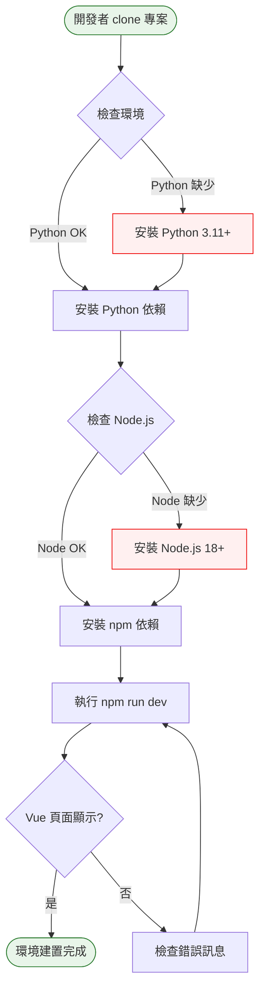

# Phase 0 互動流程：專案建置

## 1. 功能概述

**一句話**：建立專案骨架，讓開發環境可正常運作。

**核心價值**：提供一致的開發起點，確保團隊成員可快速上手。

---

## 2. 使用者與場景

| 項目 | 內容 |
|------|------|
| **使用者角色** | 開發者（自己） |
| **觸發入口** | 終端機 / CLI |
| **前置條件** | 已安裝 Python 3.11+、Node.js 18+、Git |
| **使用情境** | 首次 clone 專案後，設定開發環境 |

---

## 3. 操作流程圖

---

## 4. 逐步互動說明

### 步驟 1：Clone 專案

| | 描述 |
|---|------|
| **觸發** | 開發者執行 `git clone` |
| **操作前** | 終端機在任意目錄 |
| **系統回應** | 下載專案檔案到本地 |
| **操作後** | 進入專案目錄 `StockPayDay++` |
| **下一步** | 步驟 2：安裝 Python 依賴 |

---

### 步驟 2：安裝 Python 依賴

| | 描述 |
|---|------|
| **觸發** | 開發者執行 `pip install -r requirements.txt` |
| **操作前** | 已進入專案目錄 |
| **系統回應** | 下載並安裝 Python 套件 |
| **操作後** | Python 環境就緒 |
| **下一步** | 步驟 3：安裝 npm 依賴 |

---

### 步驟 3：安裝 npm 依賴

| | 描述 |
|---|------|
| **觸發** | 開發者執行 `cd frontend && npm install` |
| **操作前** | Python 環境就緒 |
| **系統回應** | 下載並安裝 Node.js 套件 |
| **操作後** | 前端環境就緒 |
| **下一步** | 步驟 4：驗證開發環境 |

---

### 步驟 4：驗證開發環境

| | 描述 |
|---|------|
| **觸發** | 開發者執行 `npm run dev` |
| **操作前** | 前端環境就緒 |
| **系統回應** | 啟動 Vite 開發伺服器，顯示本地網址 |
| **操作後** | 瀏覽器開啟可看到 Vue 預設頁面 |
| **下一步** | Phase 1：開始開發爬蟲 |

---

## 5. 異常處理

| 異常情境 | 使用者看到的畫面 | 恢復路徑 |
|----------|------------------|----------|
| Python 版本過舊 | `python: command not found` 或版本錯誤 | 安裝 Python 3.11+ |
| pip install 失敗 | 套件安裝錯誤訊息 | 檢查網路、使用虛擬環境 |
| Node.js 未安裝 | `node: command not found` | 安裝 Node.js 18+ |
| npm install 失敗 | 套件安裝錯誤訊息 | 清除 node_modules 重試 |
| npm run dev 失敗 | Vite 啟動錯誤 | 檢查 port 是否被占用 |

---

## 6. 邊界與限制

| 項目 | 說明 |
|------|------|
| **Python 版本** | 需 3.11 以上 |
| **Node.js 版本** | 需 18 以上 |
| **作業系統** | macOS / Linux / Windows (WSL) |
| **網路** | 安裝依賴需網路連線 |

---

## 7. 驗收檢查清單

### 環境設定
- [ ] `python --version` 顯示 3.11+
- [ ] `node --version` 顯示 18+
- [ ] `git --version` 可正常執行

### Python 環境
- [ ] `pip install -r requirements.txt` 成功完成
- [ ] 無紅色錯誤訊息

### 前端環境
- [ ] `cd frontend && npm install` 成功完成
- [ ] `node_modules/` 目錄已建立

### 開發驗證
- [ ] `npm run dev` 成功啟動
- [ ] 瀏覽器開啟顯示 Vue 頁面
- [ ] 無 console 錯誤訊息

### 專案結構
- [ ] 目錄結構符合 Tech Decision 規劃
- [ ] `.gitignore` 已正確設定
- [ ] `README.md` 已建立

---

## 📝 備註

- 此階段為純開發者操作，無前端使用者互動
- 完成後即可進入 Phase 1 開發爬蟲
