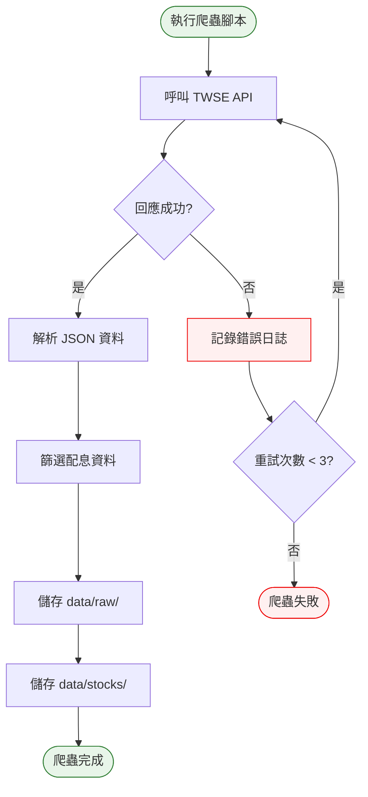

# Phase 1 互動流程：爬蟲（個股）

## 1. 功能概述

**一句話**：從 TWSE 抓取個股配息資料並儲存。

**核心價值**：建立可靠的資料擷取能力，為後續功能提供資料基礎。

---

## 2. 使用者與場景

| 項目 | 內容 |
|------|------|
| **使用者角色** | 開發者 / 系統自動觸發（GitHub Actions） |
| **觸發入口** | 終端機執行腳本 |
| **前置條件** | Phase 0 完成、網路連線正常 |
| **使用情境** | 手動測試爬蟲 或 GitHub Actions 自動執行 |

---

## 3. 操作流程圖

---

## 4. 逐步互動說明

### 步驟 1：執行爬蟲腳本

| | 描述 |
|---|------|
| **觸發** | 開發者執行 `python crawler/fetch.py` |
| **操作前** | 終端機在專案目錄 |
| **系統回應** | 顯示「開始抓取個股配息資料...」 |
| **操作後** | 爬蟲開始執行 |
| **下一步** | 步驟 2：資料抓取與儲存 |

---

### 步驟 2：資料抓取與儲存

| | 描述 |
|---|------|
| **觸發** | 爬蟲自動執行 |
| **操作前** | 爬蟲已啟動 |
| **系統回應** | 逐筆抓取 TWSE 資料，顯示進度 |
| **操作後** | 資料寫入 `data/raw/` 和 `data/stocks/` |
| **下一步** | 步驟 3：確認結果 |

---

### 步驟 3：確認結果

| | 描述 |
|---|------|
| **觸發** | 爬蟲執行完成 |
| **操作前** | 資料已儲存 |
| **系統回應** | 顯示「爬蟲完成，共抓取 N 支股票」 |
| **操作後** | 終端機顯示執行結果 |
| **下一步** | 開發者檢查資料品質 |

---

## 5. 異常處理

| 異常情境 | 使用者看到的畫面 | 恢復路徑 |
|----------|------------------|----------|
| 網路斷線 | `ConnectionError` 錯誤訊息 | 檢查網路後重試 |
| TWSE API 改版 | 回應格式異常 | 檢查並更新解析邏輯 |
| TWSE 限流 | `429 Too Many Requests` | 加入延遲機制 |
| 資料格式異常 | JSON 解析錯誤 | 檢查 TWSE 回應內容 |

---

## 6. 邊界與限制

| 項目 | 說明 |
|------|------|
| **抓取頻率** | 建議間隔 1-2 秒，避免被限流 |
| **資料範圍** | 僅限 TWSE 上市股票 |
| **執行時間** | 預計 1-2 分鐘 |
| **資料保存** | 每次執行會覆蓋舊資料 |

---

## 7. 驗收檢查清單

### 爬蟲執行
- [ ] `python crawler/fetch.py` 可正常執行
- [ ] 執行過程無紅色錯誤訊息
- [ ] 執行時間 < 2 分鐘

### 資料儲存
- [ ] `data/raw/` 有 TWSE 原始回應 JSON
- [ ] `data/stocks/` 有個股基底資料
- [ ] 至少 10 支股票資料正確

### 資料格式
- [ ] 每支股票包含 `code` 欄位
- [ ] 每支股票包含 `name` 欄位
- [ ] 每支股票包含 `dividend_history` 陣列
- [ ] `dividend_history` 包含 `ex_date` 和 `cash_dividend`

### 錯誤處理
- [ ] 網路失敗時有錯誤訊息
- [ ] 可重新執行不影響舊資料

---

## 📝 備註

- 此階段為後端操作，無前端使用者互動
- 完成後可進入 Phase 2 擴充 ETF 和特別股爬蟲
