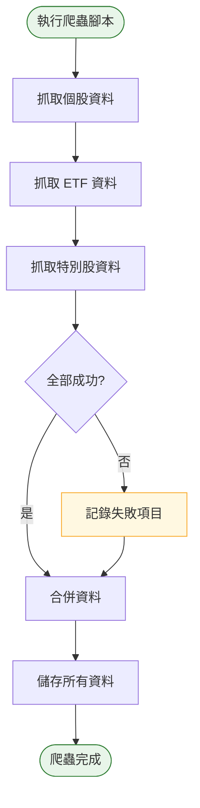

# Phase 2 互動流程：爬蟲（ETF + 特別股）

## 1. 功能概述

**一句話**：擴充爬蟲支援 ETF 和特別股配息資料。

**核心價值**：完整覆蓋 TWSE 所有配息證券，資料齊全。

---

## 2. 使用者與場景

| 項目 | 內容 |
|------|------|
| **使用者角色** | 開發者 / 系統自動觸發 |
| **觸發入口** | 終端機執行腳本 |
| **前置條件** | Phase 1 完成、個股爬蟲正常運作 |
| **使用情境** | 擴充爬蟲支援更多證券類型 |

---

## 3. 操作流程圖

---

## 4. 逐步互動說明

### 步驟 1：執行爬蟲腳本

| | 描述 |
|---|------|
| **觸發** | 開發者執行 `python crawler/fetch.py` |
| **操作前** | 終端機在專案目錄 |
| **系統回應** | 顯示「開始抓取所有證券配息資料...」 |
| **操作後** | 爬蟲依序抓取個股、ETF、特別股 |
| **下一步** | 步驟 2：依序抓取各類證券 |

---

### 步驟 2：依序抓取各類證券

| | 描述 |
|---|------|
| **觸發** | 爬蟲自動依序執行 |
| **操作前** | 爬蟲已啟動 |
| **系統回應** | 依序顯示「抓取個股中...」「抓取 ETF 中...」「抓取特別股中...」 |
| **操作後** | 各類資料分別寫入對應目錄 |
| **下一步** | 步驟 3：確認結果 |

---

### 步驟 3：確認結果

| | 描述 |
|---|------|
| **觸發** | 爬蟲執行完成 |
| **操作前** | 所有資料已儲存 |
| **系統回應** | 顯示「爬蟲完成，個股 N 支、ETF M 支、特別股 K 支」 |
| **操作後** | 終端機顯示完整統計 |
| **下一步** | 開發者檢查各類資料品質 |

---

## 5. 異常處理

| 異常情境 | 使用者看到的畫面 | 恢復路徑 |
|----------|------------------|----------|
| 個股抓取成功、ETF 失敗 | 部分成功警告訊息 | 檢查 ETF API 端點 |
| 特別股資料為空 | 「特別股無資料」提示 | 確認 TWSE 是否有特別股資料 |
| 某類證券 API 改版 | 該類別解析錯誤 | 更新對應爬蟲模組 |

---

## 6. 邊界與限制

| 項目 | 說明 |
|------|------|
| **抓取順序** | 個股 → ETF → 特別股 |
| **資料範圍** | TWSE 上市股票、ETF、特別股 |
| **執行時間** | 預計 2-3 分鐘 |
| **部分失敗** | 允許部分成功，記錄失敗項目 |

---

## 7. 驗收檢查清單

### ETF 爬蟲
- [ ] `data/etfs/` 有 ETF 基底資料
- [ ] 至少 10 支 ETF 資料正確（含 0050、0056）
- [ ] ETF 資料包含配息歷史

### 特別股爬蟲
- [ ] `data/preferred/` 有特別股基底資料
- [ ] 特別股資料格式正確

### 整合測試
- [ ] 同時抓取三類證券可正常完成
- [ ] 各類資料分別儲存到對應目錄
- [ ] 總執行時間 < 3 分鐘

### 錯誤處理
- [ ] 某類證券失敗不影響其他類別
- [ ] 失敗項目有記錄日誌

---

## 📝 備註

- Phase 1 和 Phase 2 可合併開發
- 完成後可進入 Phase 3 開發資料處理器
