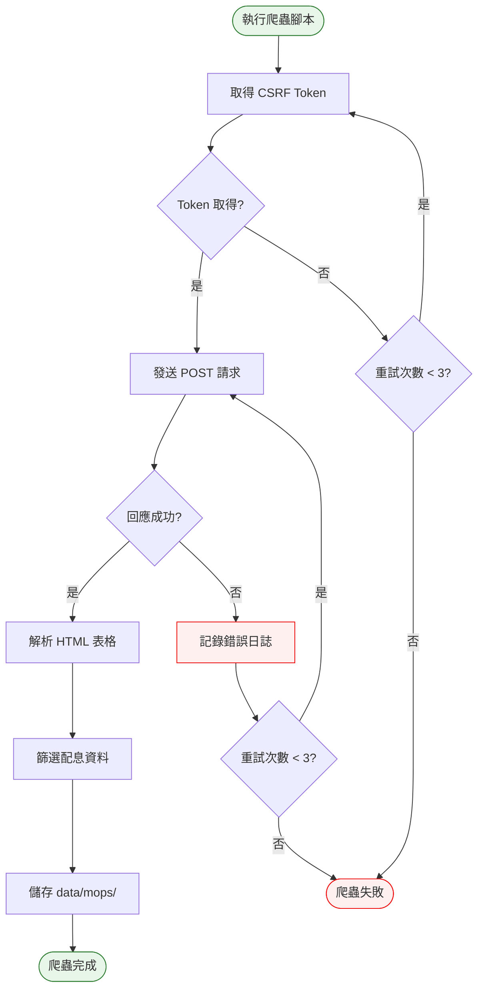

# Phase 2 互動流程：爬蟲（MOPS）

## 1. 功能概述

**一句話**：從 MOPS 抓取配息日（pay_date）資料。

**核心價值**：補充 TWT48U 缺少的配息日資訊。

---

## 2. 使用者與場景

| 項目 | 內容 |
|------|------|
| **使用者角色** | 開發者 / 系統自動觸發（GitHub Actions） |
| **觸發入口** | 終端機執行腳本 |
| **前置條件** | Phase 1 完成、網路連線正常 |
| **使用情境** | 手動測試爬蟲 或 GitHub Actions 自動執行 |

---

## 3. 操作流程圖



---

## 4. 逐步互動說明

### 步驟 1：取得 CSRF Token

**動作**：GET 請求 MOPS 頁面，從 HTML 中解析 CSRF Token

**預期結果**：
- 成功：取得 Token 字串
- 失敗：記錄錯誤，重試

### 步驟 2：發送 POST 請求

**動作**：使用 CSRF Token 發送 POST 請求

**POST 參數**：
```
csrf_token: {token}
encodeURIComponent: 1
step: 1
firstin: 1
off: 1
keyword4: 
code1: 
YEARN: 115
SEASON: 3
```

**預期結果**：
- 成功：回傳 HTML 表格
- 失敗：記錄錯誤，重試

### 步驟 3：解析 HTML 表格

**動作**：使用 BeautifulSoup 解析表格

**預期結果**：
- 找到 `table01` 或 `tableTF` 表格
- 解析每列資料

### 步驟 4：篩選配息資料

**動作**：從每列中擷取 code, ex_date, pay_date

**預期結果**：
- 跳過標題列
- 跳過 code 為空或 "合計" 的列
- 民國年日期轉換為西元年

### 步驟 5：儲存資料

**動作**：合併舊資料，寫入 JSON 檔案

**預期結果**：
- 檔案路徑：`data/mops/{YYYY}-Q{N}.json`
- 以 (code, ex_date) 為 key 去重
- 排序後寫入

---

## 5. 錯誤情境

### 情境 1：CSRF Token 取得失敗

**觸發**：MOPS 頁面結構變動

**處理**：
1. 重試 3 次
2. 記錄錯誤日誌
3. 回傳失敗

### 情境 2：POST 請求失敗

**觸發**：網路問題或 MOPS 限流

**處理**：
1. 重試 3 次（間隔遞增）
2. 記錄錯誤日誌
3. 回傳失敗

### 情境 3：HTML 表格解析失敗

**觸發**：表格結構變動

**處理**：
1. 嘗試多種選擇器
2. 記錄警告日誌
3. 回傳空列表

---

## 6. 驗證點

| 步驟 | 驗證項目 | 預期結果 |
|------|---------|---------|
| 1 | CSRF Token 取得 | Token 非空 |
| 2 | POST 請求 | HTTP 200 |
| 3 | HTML 解析 | 找到表格 |
| 4 | 資料篩選 | 至少 10 筆資料 |
| 5 | 檔案儲存 | JSON 檔案存在 |
