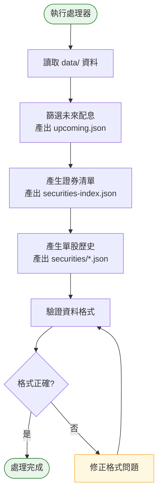

# Phase 3 互動流程：資料處理器

## 1. 功能概述

**一句話**：將基底資料轉換為前端可用的 API 檔案。

**核心價值**：資料轉換層，讓前端只需讀取簡單格式的 JSON。

---

## 2. 使用者與場景

| 項目 | 內容 |
|------|------|
| **使用者角色** | 開發者 / 系統自動觸發 |
| **觸發入口** | 終端機執行腳本 |
| **前置條件** | Phase 1-2 完成、`data/` 有完整資料 |
| **使用情境** | 爬蟲完成後，產出前端用資料 |

---

## 3. 操作流程圖

---

## 4. 逐步互動說明

### 步驟 1：執行處理器

| | 描述 |
|---|------|
| **觸發** | 開發者執行 `python processor/generate_api.py` |
| **操作前** | `data/` 目錄有完整資料 |
| **系統回應** | 顯示「開始產生 API 資料...」 |
| **操作後** | 處理器開始讀取基底資料 |
| **下一步** | 步驟 2：產生各類 API 檔案 |

---

### 步驟 2：產生各類 API 檔案

| | 描述 |
|---|------|
| **觸發** | 處理器自動執行 |
| **操作前** | 處理器已啟動 |
| **系統回應** | 依序顯示「篩選未來配息...」「產生證券清單...」「產生單股歷史...」 |
| **操作後** | `api/` 目錄產生所有 JSON 檔案 |
| **下一步** | 步驟 3：確認結果 |

---

### 步驟 3：確認結果

| | 描述 |
|---|------|
| **觸發** | 處理器執行完成 |
| **操作前** | API 檔案已產生 |
| **系統回應** | 顯示「處理完成，產出 N 筆未來配息、M 支證券」 |
| **操作後** | 終端機顯示完整統計 |
| **下一步** | 開發者檢查 API 資料格式 |

---

## 5. 異常處理

| 異常情境 | 使用者看到的畫面 | 恢復路徑 |
|----------|------------------|----------|
| data/ 目錄為空 | 「找不到基底資料」錯誤 | 先執行爬蟲 |
| 資料格式異常 | 解析錯誤訊息 | 檢查 data/ 資料格式 |
| api/ 寫入權限不足 | 權限錯誤 | 檢查目錄權限 |

---

## 6. 邊界與限制

| 項目 | 說明 |
|------|------|
| **執行順序** | 必須在爬蟲完成後執行 |
| **資料覆蓋** | 每次執行會覆蓋舊的 api/ 資料 |
| **執行時間** | 預計 < 30 秒 |
| **資料驗證** | 自動驗證 JSON 格式 |

---

## 7. 驗收檢查清單

### API 產出
- [ ] `api/upcoming.json` 已產生
- [ ] `api/securities-index.json` 已產生
- [ ] `api/securities/` 目錄有單股歷史檔案

### 資料格式
- [ ] `upcoming.json` 只包含 `ex_date >= 今天` 的資料
- [ ] `upcoming.json` 每筆包含 code, name, ex_date, pay_date, dividend
- [ ] `securities-index.json` 包含所有證券代號+名稱
- [ ] `securities/{code}.json` 每支證券一個檔案
- [ ] 單股歷史包含 history 陣列

### 執行驗證
- [ ] `python processor/generate_api.py` 可正常執行
- [ ] 執行時間 < 30 秒
- [ ] 無紅色錯誤訊息

---

## 📝 備註

- 此階段為後端操作，無前端使用者互動
- 完成後可進入 Phase 4 開發前端基礎
