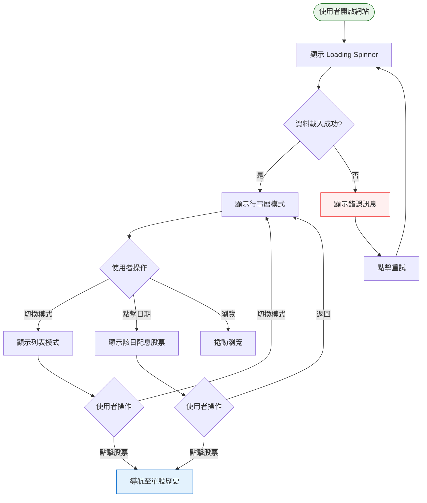

# Phase 4 互動流程：前端基礎（行事曆 + 列表）

## 1. 功能概述

**一句話**：可顯示行事曆/列表模式，瀏覽未來配息資料。

**核心價值**：使用者介面的基礎，提供未來配息的視覺化瀏覽。

---

## 2. 使用者與場景

| 項目 | 內容 |
|------|------|
| **使用者角色** | 一般投資人（訪客） |
| **觸發入口** | 瀏覽器開啟網站 URL |
| **前置條件** | 無（開放所有人訪問） |
| **使用情境** | 想快速查看最近有哪些股票要配息 |

---

## 3. 操作流程圖

---

## 4. 逐步互動說明

### 步驟 1：開啟網站

| | 描述 |
|---|------|
| **觸發** | 使用者在瀏覽器輸入網址 |
| **操作前** | 瀏覽器無畫面 |
| **系統回應** | 顯示全頁 Loading Spinner + 「載入中...」 |
| **操作後** | 顯示行事曆模式，預設當月 |
| **下一步** | 步驟 2：瀏覽或切換模式 |

---

### 步驟 2：瀏覽行事曆

| | 描述 |
|---|------|
| **觸發** | 頁面載入完成 |
| **操作前** | 顯示行事曆 |
| **系統回應** | 行事曆正確顯示當月份，有配息的日期有圓點標示 |
| **操作後** | 使用者可看到整月配息分佈 |
| **下一步** | 步驟 3：切換模式 或 點擊日期 |

---

### 步驟 3：切換顯示模式

| | 描述 |
|---|------|
| **觸發** | 使用者點擊「列表」Tab |
| **操作前** | 顯示行事曆模式 |
| **系統回應** | 即時切換為列表模式，無需重新載入 |
| **操作後** | 顯示列表，依日期排序 |
| **下一步** | 步驟 4：瀏覽列表 |

---

### 步驟 4：瀏覽列表

| | 描述 |
|---|------|
| **觸發** | 切換至列表模式 |
| **操作前** | 顯示列表 |
| **系統回應** | 列表顯示所有未來配息，每筆包含日期、代號、名稱、金額 |
| **操作後** | 使用者可捲動瀏覽 |
| **下一步** | 步驟 5：點擊股票查看歷史（Phase 5） |

---

### 步驟 5：點擊日期（行事曆模式）

| | 描述 |
|---|------|
| **觸發** | 使用者點擊有配息標示的日期 |
| **操作前** | 顯示完整行事曆 |
| **系統回應** | 顯示該日配息股票列表（Modal 或下拉） |
| **操作後** | 使用者可看到該日有哪些股票配息 |
| **下一步** | 點擊股票 → 步驟 6 |

---

## 5. 異常處理

| 異常情境 | 使用者看到的畫面 | 恢復路徑 |
|----------|------------------|----------|
| 網路斷線 | 錯誤訊息「資料載入失敗」+ 重試按鈕 | 點擊重試 |
| 無配息資料 | 空狀態「目前沒有即將配息的證券」 | 等待資料更新 |
| API 檔案 404 | 錯誤訊息 | 檢查 api/ 部署 |

---

## 6. 邊界與限制

| 項目 | 說明 |
|------|------|
| **資料來源** | 讀取 `api/upcoming.json` |
| **更新頻率** | 資料每日更新一次 |
| **瀏覽器** | 現代瀏覽器（Chrome、Firefox、Safari、Edge） |
| **並發** | 無限制（靜態檔案） |

---

## 7. 驗收檢查清單

### 首頁載入
- [ ] 開啟網站顯示 Loading Spinner
- [ ] 資料載入後顯示行事曆模式
- [ ] 預設顯示當前月份
- [ ] 載入失敗顯示錯誤訊息

### 行事曆模式
- [ ] 行事曆正確顯示 7 欄（日~六）
- [ ] 有配息的日期有視覺標示（圓點或顏色）
- [ ] 可點擊日期查看該日配息股票
- [ ] 顯示當月月份標題

### 列表模式
- [ ] 可切換至列表模式
- [ ] 列表依日期排序（近的在前）
- [ ] 每筆顯示：日期、代號、名稱、金額
- [ ] 可切換回行事曆模式

### 互動
- [ ] 模式切換即時，無重新載入
- [ ] 行事曆日期可點擊
- [ ] 列表股票可點擊（Phase 5 實作）

### 響應式
- [ ] 手機版（< 768px）行事曆可正常顯示
- [ ] 手機版列表可正常捲動

---

## 📝 備註

- 此階段為前端使用者互動
- Phase 5 會加入單股歷史頁面和搜尋功能
- 資料來自 `api/upcoming.json`（由 Phase 3 產出）
