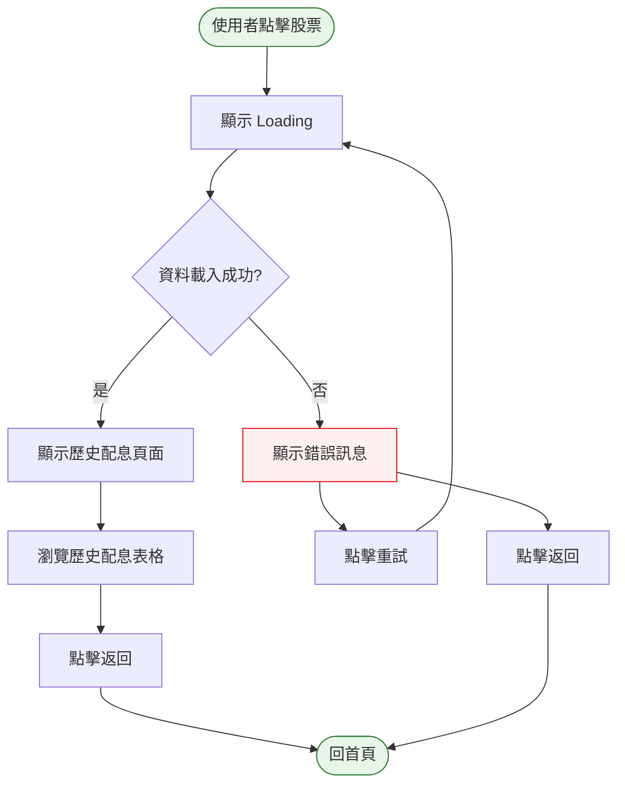
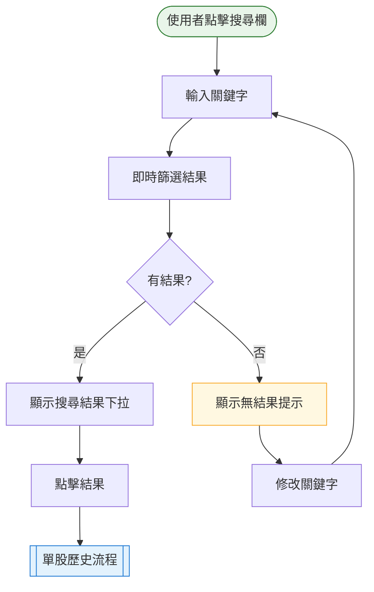

# Phase 5 互動流程：前端進階（單股歷史 + 搜尋）

## 1. 功能概述

**一句話**：可查看單一證券歷史配息紀錄，並可搜尋股票。

**核心價值**：深入了解個股配息表現，快速找到目標證券。

---

## 2. 使用者與場景

| 項目 | 內容 |
|------|------|
| **使用者角色** | 一般投資人（訪客） |
| **觸發入口** | 點擊股票（行事曆/列表）或使用搜尋欄 |
| **前置條件** | Phase 4 完成、首頁可正常顯示 |
| **使用情境** | 想查看某支股票歷史配息，或快速搜尋特定股票 |

---

## 3. 操作流程圖

### 主流程：單股歷史

### 主流程：搜尋

---

## 4. 逐步互動說明

### 步驟 1：點擊股票

| | 描述 |
|---|------|
| **觸發** | 使用者在行事曆或列表點擊股票 |
| **操作前** | 使用者在首頁 |
| **系統回應** | 導航至單股歷史頁面，顯示 Loading Spinner |
| **操作後** | URL 變更為 `/stock/{code}` |
| **下一步** | 步驟 2：顯示歷史配息 |

---

### 步驟 2：顯示歷史配息

| | 描述 |
|---|------|
| **觸發** | 頁面載入完成 |
| **操作前** | 顯示 Loading |
| **系統回應** | 顯示證券名稱、代號、歷史配息表格 |
| **操作後** | 使用者可看到該證券過去數年配息紀錄 |
| **下一步** | 步驟 3：瀏覽或返回 |

---

### 步驟 3：瀏覽歷史配息

| | 描述 |
|---|------|
| **觸發** | 頁面載入完成 |
| **操作前** | 歷史頁面已顯示 |
| **系統回應** | 表格顯示：年份、除權息日、配息金額 |
| **操作後** | 使用者可捲動瀏覽所有歷史 |
| **下一步** | 步驟 4：返回首頁 |

---

### 步驟 4：返回首頁

| | 描述 |
|---|------|
| **觸發** | 使用者點擊「← 返回」按鈕 |
| **操作前** | 使用者在單股歷史頁面 |
| **系統回應** | 導航回首頁 |
| **操作後** | 回到行事曆/列表模式 |
| **下一步** | 繼續瀏覽其他股票 |

---

### 步驟 5：使用搜尋欄

| | 描述 |
|---------|------|
| **觸發** | 使用者點擊搜尋欄 |
| **操作前** | 搜尋欄為空 |
| **系統回應** | 搜尋欄取得焦點，準備輸入 |
| **操作後** | 使用者可輸入關鍵字 |
| **下一步** | 步驟 6：輸入搜尋 |

---

### 步驟 6：輸入搜尋

| | 描述 |
|---|------|
| **觸發** | 使用者輸入股票代號或名稱 |
| **操作前** | 搜尋欄有焦點 |
| **系統回應** | 即時篩選 `securities-index.json`，顯示符合結果下拉 |
| **操作後** | 顯示搜尋結果列表 |
| **下一步** | 步驟 7：選擇結果 |

---

### 步驟 7：選擇搜尋結果

| | 描述 |
|---|------|
| **觸發** | 使用者點擊搜尋結果 |
| **操作前** | 顯示搜尋結果下拉 |
| **系統回應** | 導航至該股票歷史頁面 |
| **操作後** | 顯示該股票歷史配息 |
| **下一步** | 步驟 3：瀏覽歷史 |

---

## 5. 異常處理

| 異常情境 | 使用者看到的畫面 | 恢復路徑 |
|----------|------------------|----------|
| 股票資料不存在 | 錯誤訊息「找不到該證券資料」 | 返回首頁 |
| 網路斷線 | 錯誤訊息「資料載入失敗」+ 重試 | 點擊重試 |
| 搜尋無結果 | 「找不到符合的證券」提示 | 修改關鍵字 |
| 歷史資料為空 | 「暫無歷史配息資料」提示 | 返回首頁 |

---

## 6. 邊界與限制

| 項目 | 說明 |
|------|------|
| **資料來源** | 讀取 `api/securities/{code}.json` |
| **搜尋資料** | 讀取 `api/securities-index.json` |
| **歷史深度** | 依資料而定，通常 3-5 年 |
| **搜尋方式** | 代號或名稱模糊搜尋 |

---

## 7. 驗收檢查清單

### 單股歷史頁面
- [ ] 點擊股票後導航至歷史頁面
- [ ] URL 格式為 `/stock/{code}`
- [ ] 顯示 Loading Spinner
- [ ] 正確顯示股票代號與名稱
- [ ] 歷史配息表格顯示：年份、除權息日、配息金額
- [ ] 歷史依年份排序（新→舊）
- [ ] 返回按鈕可回首頁
- [ ] 載入失敗顯示錯誤訊息

### 搜尋功能
- [ ] 搜尋欄可點擊取得焦點
- [ ] 可輸入股票代號搜尋
- [ ] 可輸入股票名稱搜尋
- [ ] 即時顯示搜尋結果（無需按 Enter）
- [ ] 搜尋結果顯示：代號、名稱
- [ ] 點擊結果導航至歷史頁面
- [ ] 無結果時顯示提示訊息

### 導航
- [ ] 從首頁可導航至歷史頁面
- [ ] 從歷史頁面可返回首頁
- [ ] 從搜尋結果可導航至歷史頁面

### 響應式
- [ ] 手機版歷史頁面可正常顯示
- [ ] 手機版搜尋欄可正常使用

---

## 📝 備註

- 此階段完成後，核心功能已完整
- Phase 6 會加入 LINE Notify 通知功能
- 資料來自 `api/securities/` 和 `api/securities-index.json`
