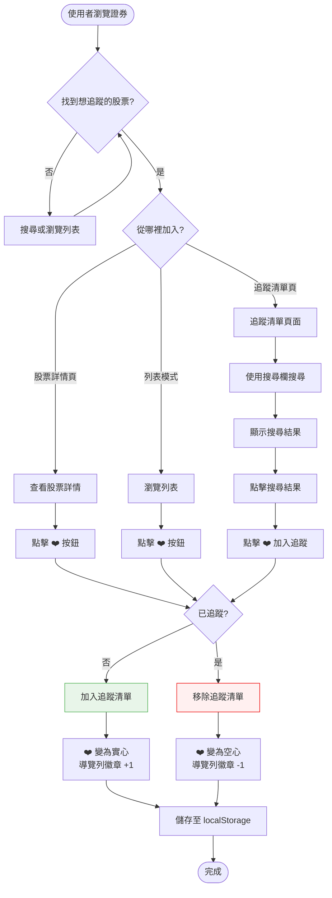
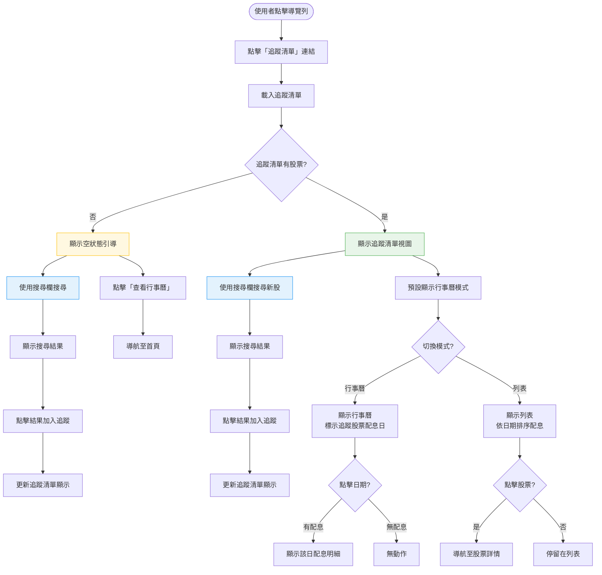

# Phase 5a 追蹤清單 — 操作流程設計

> **功能編號**：Phase 5a
> **功能名稱**：追蹤清單
> **核心價值**：讓使用者收藏感興趣的證券，在專屬頁面掌握其配息時程
> **前置文件**：`docs/development/phases/phase-5a-追蹤清單.md`

---

## 1. 功能概述

讓使用者可將感兴趣的證券加入追蹤清單，並在專屬頁面以行事曆或列表模式查看追蹤股票的配息資訊。

---

## 2. 使用者與場景

### 使用者角色

| 角色 | 說明 |
|------|------|
| 一般使用者 | 訪客即可使用，無需登入，資料儲存於瀏覽器 |

### 觸發入口

| 入口 | 位置 | 說明 |
|------|------|------|
| ❤️ 追蹤按鈕 | 股票詳情頁（`/stock/:code`） | 頁面右上角大型按鈕 |
| ❤️ 追蹤按鈕 | 列表模式每一列 | 列表項目右側小型按鈕 |
| 📋 追蹤清單連結 | 導覽列 | 顯示追蹤數量徽章，點擊進入追蹤清單頁 |
| 🔍 搜尋加入 | 追蹤清單頁面頂部 | 搜尋欄 + 即時搜尋結果，點擊加入追蹤 |

### 前置條件

- ☐ 無（開放所有人使用）
- ☐ 追蹤資料儲存於 localStorage，每台裝置獨立

### 使用情境

| 情境 | 說明 |
|------|------|
| 從股票詳情頁加入追蹤 | 使用者搜尋或點擊股票後，在詳情頁點擊 ❤️ |
| 從列表快速追蹤 | 使用者在行事曆/列表模式，快速點擊 ❤️ 加入 |
| 從追蹤清單頁搜尋加入 | 使用者在追蹤清單頁面，透過搜尋欄找到股票並加入 |
| 查看追蹤清單 | 使用者點擊導覽列「追蹤清單」連結 |
| 移除追蹤 | 使用者在任何位置再次點擊 ❤️ 移除 |

---

## 3. 操作流程圖

### 主流程：加入追蹤

### 主流程：查看追蹤清單 + 搜尋加入

---

## 4. 逐步互動說明

### 步驟 1：從股票詳情頁加入追蹤

| | 描述 |
|---|------|
| **觸發** | 使用者在股票詳情頁（`/stock/:code`）點擊右上角 ❤️ 按鈕 |
| **操作前** | ❤️ 為空心（未追蹤），導覽列徽章顯示目前追蹤數量 |
| **系統回應** | ❤️ 圖示變為實心紅色，導覽列追蹤清單徽章數字 +1 |
| **操作後** | 該股票已加入追蹤清單，資料儲存至 localStorage |
| **下一步** | 步驟 3：查看追蹤清單，或繼續瀏覽其他股票 |

### 步驟 2：從列表模式加入追蹤

| | 描述 |
|---|------|
| **觸發** | 使用者在列表模式中，點擊任一列表項目右側的小型 ❤️ 按鈕 |
| **操作前** | ❤️ 為空心（未追蹤），列表項目顯示日期、代號、名稱、金額 |
| **系統回應** | ❤️ 圖示變為實心紅色，導覽列徽章數字 +1 |
| **操作後** | 該股票已加入追蹤清單，資料儲存至 localStorage |
| **下一步** | 繼續瀏覽列表，或點擊股票名稱查看详情 |

### 步驟 2a：從追蹤清單頁搜尋加入追蹤

| | 描述 |
|---|------|
| **觸發** | 使用者在追蹤清單頁面，點擊搜尋欄輸入股票代號或名稱 |
| **操作前** | 追蹤清單頁面已載入，搜尋欄為空 |
| **系統回應** | 即時顯示搜尋結果下拉列表（最多 10 筆） |
| **操作後** | 搜尋結果顯示符合的股票，每筆含代號、名稱、❤️ 按鈕 |
| **下一步** | 步驟 2b：點擊搜尋結果加入追蹤 |

### 步驟 2b：點擊搜尋結果加入追蹤

| | 描述 |
|---|------|
| **觸發** | 使用者在搜尋結果中，點擊 ❤️ 按鈕或點擊股票名稱 |
| **操作前** | 搜尋結果下拉顯示中，該股票未追蹤 |
| **系統回應** | ❤️ 圖示變為實心紅色，導覽列徽章 +1，追蹤清單立即更新 |
| **操作後** | 該股票加入追蹤清單，追蹤清單視圖新增該股票的配息資訊 |
| **下一步** | 搜尋欄清空，可繼續搜尋下一支股票 |

### 步驟 3：查看追蹤清單

| | 描述 |
|---|------|
| **觸發** | 使用者點擊導覽列「❤️ 追蹤清單」連結 |
| **操作前** | 使用者在任何頁面，導覽列顯示追蹤清單徽章（含數量） |
| **系統回應** | 導航至 `/watchlist`，載入追蹤清單資料 |
| **操作後** | 顯示追蹤清單頁面，預設為行事曆模式 |
| **下一步** | 步驟 4：瀏覽追蹤清單，或步驟 5：移除追蹤 |

### 步驟 4：切換追蹤清單顯示模式

| | 描述 |
|---|------|
| **觸發** | 使用者點擊「📋 列表」或「📅 行事曆」切換按鈕 |
| **操作前** | 目前顯示一種模式（行事曆或列表） |
| **系統回應** | 即時切換顯示模式，無載入延遲 |
| **操作後** | 顯示選定模式的追蹤股票資料 |
| **下一步** | 步驟 5：移除追蹤，或繼續瀏覽 |

### 步驟 5：移除追蹤

| | 描述 |
|---|------|
| **觸發** | 使用者在任何位置點擊已追蹤的 ❤️ 按鈕（實心狀態） |
| **操作前** | ❤️ 為實心紅色（已追蹤），導覽列徽章顯示追蹤數量 |
| **系統回應** | ❤️ 圖示變為空心，導覽列徽章數字 -1 |
| **操作後** | 該股票已從追蹤清單移除，資料更新至 localStorage |
| **下一步** | 繼續瀏覽，或若追蹤清單為空則顯示空狀態 |

---

## 5. 異常處理

| 異常情境 | 使用者看到的回饋 | 恢復路徑 |
|----------|-----------------|----------|
| localStorage 不可用（隱私模式） | 追蹤操作正常執行，但關閉瀏覽器後資料消失 | 無法恢復，屬於預期行為 |
| localStorage 已滿 | 追蹤操作正常執行，但無法持久化 | 清理其他 localStorage 資料 |
| 追蹤股票已下市 | 追蹤清單仍顯示該股票，配息資訊顯示「無資料」 | 使用者手動移除 |
| 即將配息資料載入失敗 | 追蹤清單顯示，但行事曆/列表無配息標記 | 重新整理頁面 |
| 追蹤清單為空 | 顯示空狀態引導畫面，提供搜尋欄和「查看行事曆」按鈕 | 使用搜尋欄加入追蹤 |
| 搜尋無結果 | 顯示「找不到符合的證券」提示 | 修改搜尋關鍵字 |
| 搜尋欄輸入為空 | 不顯示搜尋結果下拉 | 輸入至少一個字元 |

---

## 6. 邊界與限制

| 項目 | 說明 |
|------|------|
| 追蹤數量上限 | 無硬性限制，但建議不超過 100 支（影響 UI 效能） |
| 多裝置同步 | 不支援，每台裝置的追蹤清單獨立 |
| 資料保留 | 追蹤清單永久保留，除非使用者手動移除或清除瀏覽器資料 |
| 即時更新 | 追蹤清單的配息資訊來自 `api/upcoming.json`，需重新載入才會更新 |
| 證券名稱變更 | 以證券代號為主鍵，名稱變更不影響追蹤狀態 |
| 搜尋結果上限 | 最多顯示 10 筆搜尋結果 |

---

## 7. 驗收檢查清單

### 加入追蹤
- [ ] 在股票詳情頁點擊 ❤️ 後，圖示變為實心紅色
- [ ] 在列表模式點擊 ❤️ 後，圖示變為實心紅色
- [ ] 加入追蹤後，導覽列徽章數字 +1
- [ ] 加入追蹤後，重新整理頁面仍為實心狀態

### 從追蹤清單頁搜尋加入
- [ ] 追蹤清單頁面頂部顯示搜尋欄
- [ ] 搜尋欄可輸入股票代號搜尋
- [ ] 搜尋欄可輸入股票名稱搜尋
- [ ] 搜尋結果顯示代號、名稱、❤️ 按鈕
- [ ] 點擊搜尋結果的 ❤️ 可加入追蹤
- [ ] 加入追蹤後追蹤清單立即更新顯示
- [ ] 搜尋無結果時顯示「找不到符合的證券」提示
- [ ] 搜尋欄清空後下拉列表消失

### 移除追蹤
- [ ] 點擊已追蹤的 ❤️ 後，圖示變為空心
- [ ] 移除追蹤後，導覽列徽章數字 -1
- [ ] 移除追蹤後，重新整理頁面仍為空心狀態

### 追蹤清單頁面
- [ ] 點擊導覽列「追蹤清單」連結可導航至 `/watchlist`
- [ ] 追蹤清單為空時顯示引導畫面
- [ ] 追蹤清單有股票時預設顯示行事曆模式
- [ ] 可切換行事曆/列表模式

### 追蹤清單內容
- [ ] 行事曆模式正確標示追蹤股票的配息日期（紅色圓點）
- [ ] 列表模式正確顯示追蹤股票的配息資料
- [ ] 行事曆模式可點擊日期查看配息明細

### 持久化
- [ ] 關閉瀏覽器再開啟後，追蹤清單仍存在
- [ ] 在不同頁面間切換，追蹤狀態保持一致

### 導覽列整合
- [ ] 導覽列顯示追蹤清單連結
- [ ] 有追蹤股票時連結顯示數量徽章
- [ ] 追蹤清單為空時不顯示徽章

### 響應式
- [ ] 手機版追蹤按鈕可正常點擊
- [ ] 手機版追蹤清單頁面可正常顯示
- [ ] 手機版搜尋欄可正常使用

---

## 📝 備註

- 此功能為純前端，無後端 API 依賴
- 追蹤清單的配息資料來自 `api/upcoming.json`，需搭配 Phase 3 資料處理器
- 未來可擴展：匯出/匯入追蹤清單、雲端同步、通知功能整合
