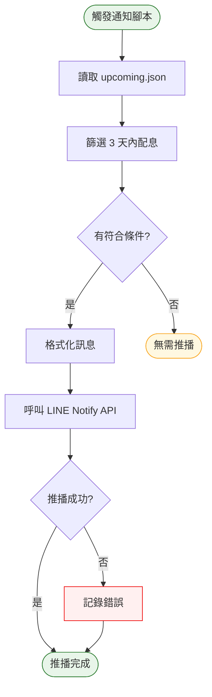

# Phase 6 互動流程：通知功能（LINE Notify）

## 1. 功能概述

**一句話**：配息日前自動推播 LINE 通知提醒使用者。

**核心價值**：主動提醒，讓使用者不會錯過配息時機。

---

## 2. 使用者與場景

| 項目 | 內容 |
|------|------|
| **使用者角色** | 系統自動觸發 / 開發者（測試用） |
| **觸發入口** | GitHub Actions 自動 或 終端機手動執行 |
| **前置條件** | Phase 3 完成、`api/upcoming.json` 有資料、LINE Notify Token 已設定 |
| **使用情境** | 每日自動檢查並推播即將配息的證券 |

---

## 3. 操作流程圖



---

## 4. 逐步互動說明

### 步驟 1：觸發通知腳本

| | 描述 |
|---|------|
| **觸發** | GitHub Actions 自動 或 開發者執行 `python processor/notify.py` |
| **操作前** | 系統時間到達排程時間 |
| **系統回應** | 開始讀取 `api/upcoming.json` |
| **操作後** | 通知腳本啟動 |
| **下一步** | 步驟 2：篩選配息證券 |

---

### 步驟 2：篩選配息證券

| | 描述 |
|---|------|
| **觸發** | 通知腳本自動執行 |
| **操作前** | 資料已讀取 |
| **系統回應** | 篩選 `ex_date` 在 3 天內的證券 |
| **操作後** | 產生符合條件的證券清單 |
| **下一步** | 步驟 3：檢查是否有符合條件 |

---

### 步驟 3：檢查是否有符合條件

| | 描述 |
|---|------|
| **觸發** | 篩選完成 |
| **操作前** | 有篩選結果 |
| **系統回應** | 檢查清單是否為空 |
| **操作後** | 決定是否推播 |
| **下一步** | 步驟 4：格式化訊息（有符合條件）或 結束（無符合條件） |

---

### 步驟 4：格式化訊息

| | 描述 |
|---|------|
| **觸發** | 有符合條件的證券 |
| **操作前** | 有篩選結果 |
| **系統回應** | 產生推播訊息格式 |
| **操作後** | 訊息準備完成 |
| **下一步** | 步驟 5：推播 |

---

### 步驟 5：推播

| | 描述 |
|---|------|
| **觸發** | 訊息準備完成 |
| **操作前** | 有推播訊息 |
| **系統回應** | 呼叫 LINE Notify API |
| **操作後** | 推播完成 |
| **下一步** | 步驟 6：確認結果 |

---

### 步驟 6：確認結果

| | 描述 |
|---|------|
| **觸發** | 推播完成 |
| **操作前** | API 已回應 |
| **系統回應** | 記錄成功或失敗 |
| **操作後** | 記錄日誌 |
| **下一步** | 結束 |

---

## 5. 異常處理

| 異常情境 | 使用者看到的畫面 | 恢復路徑 |
|----------|------------------|----------|
| LINE Notify Token 無效 | 401 錯誤 | 重新設定 Token |
| LINE Notify API 失敗 | 5xx 錯誤 | 自動重試或記錄日誌 |
| upcoming.json 不存在 | 檔案錯誤 | 先執行 processor |
| 無符合條件 | 記錄「無需推播」 | 正常行為，無需處理 |

---

## 6. 邊界與限制

| 項目 | 說明 |
|------|------|
| **推播頻率** | 每日一次（與 processor 同步） |
| **篩選條件** | 除權息日在 3 天內 |
| **訊息格式** | 純文字，包含代號、名稱、日期、金額 |
| **推播對象** | LINE Notify Token 對應的聊天室或使用者 |

---

## 7. 驗收檢查清單

### 腳本執行
- [ ] `python processor/notify.py` 可正常執行
- [ ] 無紅色錯誤訊息

### 資料篩選
- [ ] 正確讀取 `api/upcoming.json`
- [ ] 篩選 `ex_date` 在 3 天內的證券
- [ ] 無符合條件時不推播

### 推播功能
- [ ] 呼叫 LINE Notify API 成功
- [ ] 推播訊息包含：代號、名稱、除權息日、配息金額
- [ ] 訊息格式清晰易讀

### 錯誤處理
- [ ] Token 無效時有錯誤訊息
- [ ] API 失敗時有記錄日誌
- [ ] 不會因錯誤中斷整個流程

---

## 📝 推播訊息範例

```
📢 配息提醒

以下證券即將除權息：

• 0056 元大高股息
  除權息日：2026-07-20
  配息金額：$1.80

• 2330 台積電
  除權息日：2026-07-25
  配息金額：$3.50
```

---

## 📝 備註

- 此階段為後端自動化，無前端使用者互動
- 推播訊息接收者為 LINE 使用者
- 完成後可進入 Phase 7 設定 GitHub Actions 自動化
