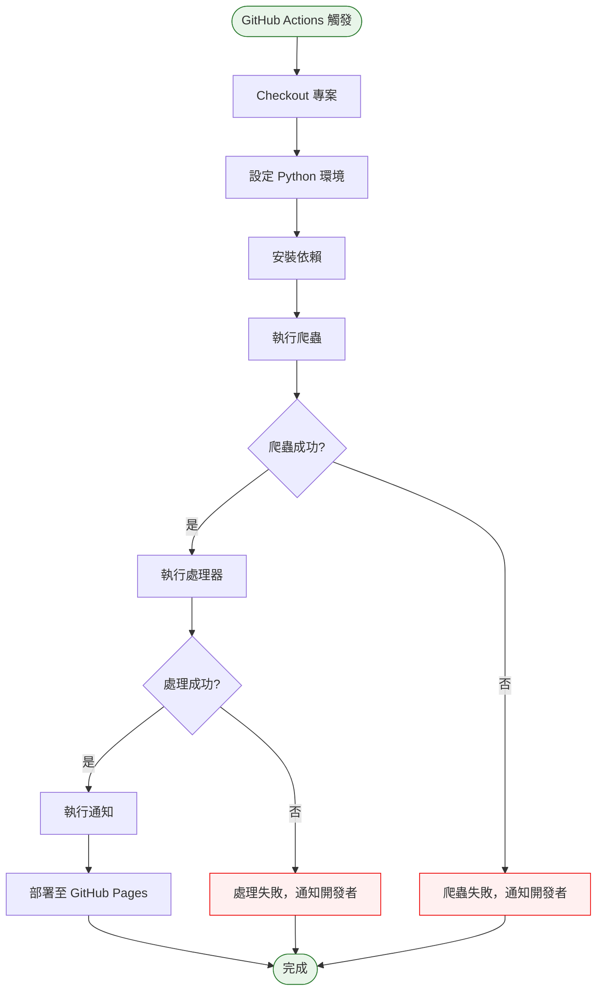

# Phase 7 互動流程：自動化部署（GitHub Actions）

## 1. 功能概述

**一句話**：GitHub Actions 每日自動執行爬蟲 + 處理 + 通知 + 部署。

**核心價值**：全自動化，無需人工介入，資料每日更新。

---

## 2. 使用者與場景

| 項目 | 內容 |
|------|------|
| **使用者角色** | 開發者（設定）/ 系統自動執行 |
| **觸發入口** | GitHub Actions cron 排程 或 手動觸發 |
| **前置條件** | Phase 0-6 完成、GitHub repo 設定完成 |
| **使用情境** | 每日自動更新資料並部署至 GitHub Pages |

---

## 3. 操作流程圖

---

## 4. 逐步互動說明

### 步驟 1：GitHub Actions 觸發

| | 描述 |
|---|------|
| **觸發** | Cron 排程（每日 UTC 08:00）或 手動觸發 |
| **操作前** | 系統時間到達排程時間 |
| **系統回應** | GitHub Actions 啟動 workflow |
| **操作後** | 開始執行自動化流程 |
| **下一步** | 步驟 2：Checkout 專案 |

---

### 步驟 2：Checkout 專案

| | 描述 |
|---|------|
| **觸發** | Workflow 啟動 |
| **操作前** | Workflow 已啟動 |
| **系統回應** | 下載專案程式碼 |
| **操作後** | 專案程式碼在 runner 上 |
| **下一步** | 步驟 3：設定環境 |

---

### 步驟 3：設定環境

| | 描述 |
|---|------|
| **觸發** | Checkout 完成 |
| **操作前** | 專案已下載 |
| **系統回應** | 設定 Python 環境、安裝依賴 |
| **操作後** | 環境就緒 |
| **下一步** | 步驟 4：執行爬蟲 |

---

### 步驟 4：執行爬蟲

| | 描述 |
|---|------|
| **觸發** | 環境就緒 |
| **操作前** | 環境設定完成 |
| **系統回應** | 執行 `python crawler/fetch.py` |
| **操作後** | 爬蟲完成，資料寫入 `data/` |
| **下一步** | 步驟 5：執行處理器 |

---

### 步驟 5：執行處理器

| | 描述 |
|---|------|
| **觸發** | 爬蟲成功 |
| **操作前** | `data/` 有新資料 |
| **系統回應** | 執行 `python processor/generate_api.py` |
| **操作後** | `api/` 資料更新 |
| **下一步** | 步驟 6：執行通知 |

---

### 步驟 6：執行通知

| | 描述 |
|---|------|
| **觸發** | 處理器成功 |
| **操作前** | `api/upcoming.json` 已更新 |
| **系統回應** | 執行 `python processor/notify.py` |
| **操作後** | LINE Notify 推播完成 |
| **下一步** | 步驟 7：部署 |

---

### 步驟 7：部署

| | 描述 |
|---|------|
| **觸發** | 通知完成 |
| **操作前** | 所有處理完成 |
| **系統回應** | 部署 `api/` 至 GitHub Pages |
| **操作後** | 網站資料更新 |
| **下一步** | 結束 |

---

## 5. 異常處理

| 異常情境 | 使用者看到的畫面 | 恢復路徑 |
|----------|------------------|----------|
| 爬蟲失敗 | GitHub Actions 失敗通知 | 檢查 logs，手動重試 |
| 處理器失敗 | GitHub Actions 失敗通知 | 檢查 data/ 格式 |
| 通知失敗 | 記錄錯誤，不影響部署 | 檢查 LINE Notify Token |
| 部署失敗 | GitHub Actions 失敗通知 | 檢查 GitHub Pages 設定 |

---

## 6. 邊界與限制

| 項目 | 說明 |
|------|------|
| **執行頻率** | 每日一次（可手動觸發） |
| **執行時間限制** | GitHub Actions 免費方案 6 分鐘/次 |
| **並發** | 同一 workflow 不會並發執行 |
| ** Secrets** | LINE_NOTIFY_TOKEN 需設定在 GitHub Secrets |

---

## 7. 驗收檢查清單

### Workflow 設定
- [ ] `.github/workflows/update.yml` 已建立
- [ ] Cron 排程設定正確（每日 UTC 08:00）
- [ ] 支援手動觸發（workflow_dispatch）

### 環境設定
- [ ] Python 3.11 環境正確設定
- [ ] 依賴安裝成功

### 執行流程
- [ ] 爬蟲可正常執行
- [ ] 處理器可正常執行
- [ ] 通知可正常執行
- [ ] 部署可正常執行

### 錯誤處理
- [ ] 爬蟲失敗時 workflow 標記失敗
- [ ] 處理器失敗時 workflow 標記失敗
- [ ] 失敗時 GitHub 有通知

### 部署驗證
- [ ] GitHub Pages 可正常訪問
- [ ] 資料已更新至最新
- [ ] 網站功能正常

---

## 📝 備註

- 此階段為後端自動化，無前端使用者互動
- 完成後系統全自動運作
- Phase 8 為最後的優化打磨
