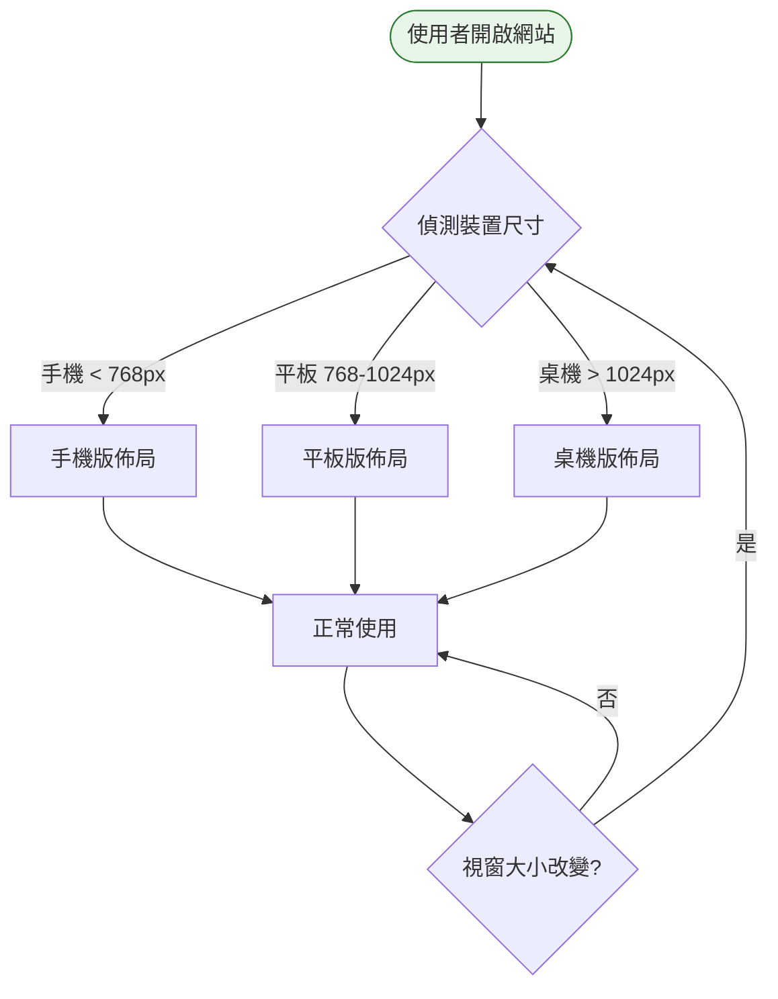
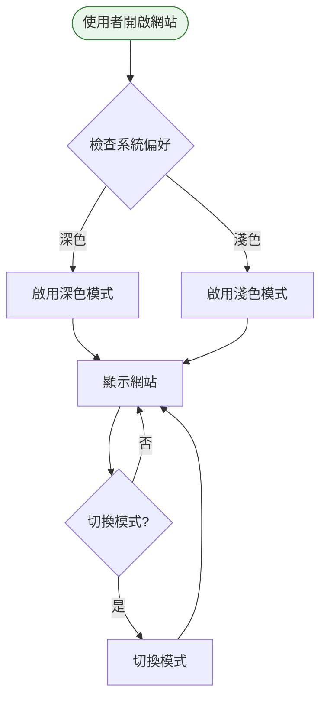

# Phase 8 互動流程：優化打磨（RWD + 深色模式）

## 1. 功能概述

**一句話**：響應式設計、深色模式、體驗優化。

**核心價值**：提供跨裝置的良好體驗，視覺舒適度提升。

---

## 2. 使用者與場景

| 項目 | 內容 |
|------|------|
| **使用者角色** | 一般投資人（訪客） |
| **觸發入口** | 瀏覽器開啟網站 |
| **前置條件** | Phase 0-7 完成、核心功能正常 |
| **使用情境** | 在手機、平板、桌機上使用；偏好深色模式 |

---

## 3. 操作流程圖

### RWD 流程

### 深色模式流程

---

## 4. 逐步互動說明

### 步驟 1：開啟網站（RWD）

| | 描述 |
|---|------|
| **觸發** | 使用者在不同裝置開啟網站 |
| **操作前** | 瀏覽器無畫面 |
| **系統回應** | 偵測視窗尺寸，載入對應佈局 |
| **操作後** | 顯示適合當前裝置的佈局 |
| **下一步** | 步驟 2：正常使用 |

---

### 步驟 2：正常使用（RWD）

| | 描述 |
|---|------|
| **觸發** | 頁面載入完成 |
| **操作前** | 佈局已載入 |
| **系統回應** | 顯示適合當前裝置的完整功能 |
| **操作後** | 使用者可正常使用所有功能 |
| **下一步** | 繼續使用 |

---

### 步驟 3：調整視窗大小（RWD）

| | 描述 |
|---|------|
| **觸發** | 使用者調整瀏覽器視窗大小 |
| **操作前** | 顯示當前佈局 |
| **系統回應** | 即時調整佈局（無重新載入） |
| **操作後** | 顯示適合新尺寸的佈局 |
| **下一步** | 繼續使用 |

---

### 步驟 4：檢查系統偏好（深色模式）

| | 描述 |
|---|------|
| **觸發** | 首次開啟網站 |
| **操作前** | 瀏覽器無畫面 |
| **系統回應** | 檢查作業系統深色模式偏好 |
| **操作後** | 套用對應主題 |
| **下一步** | 步驟 5：顯示網站 |

---

### 步驟 5：顯示網站（深色模式）

| | 描述 |
|---|------|
| **觸發** | 主題已設定 |
| **操作前** | 主題已偵測 |
| **系統回應** | 顯示對應主題的網站 |
| **操作後** | 使用者看到深色或淺色主題 |
| **下一步** | 繼續使用 |

---

### 步驟 6：切換模式（深色模式）

| | 描述 |
|---|------|
| **觸發** | 使用者點擊深色模式切換按鈕 |
| **操作前** | 顯示當前主題 |
| **系統回應** | 即時切換主題（無重新載入） |
| **操作後** | 顯示新主題 |
| **下一步** | 繼續使用 |

---

## 5. 異常處理

| 異常情境 | 使用者看到的畫面 | 恢復路徑 |
|----------|------------------|----------|
| 深色模式切換失敗 | 保持當前主題 | 重新整理頁面 |
| RWD 佈局異常 | 顯示不完整 | 調整視窗大小或重新整理 |

---

## 6. 邊界與限制

| 項目 | 說明 |
|------|------|
| **RWD 斷點** | 768px（手機/平板）、1024px（平板/桌機） |
| **深色模式** | 支援系統偏好偵測 + 手動切換 |
| **瀏覽器** | 現代瀏覽器（不支援 IE） |
| **效能** | 切換主題無重新載入 |

---

## 7. 驗收檢查清單

### RWD 響應式設計

#### 手機版（< 768px）
- [ ] 行事曆可正常顯示（可能縮小或改為列表）
- [ ] 列表可正常捲動
- [ ] 搜尋欄可正常使用
- [ ] 單股歷史頁面可正常顯示
- [ ] 導航功能正常

#### 平板版（768px - 1024px）
- [ ] 佈局適中，不會太擁擠
- [ ] 所有功能可正常使用

#### 桌機版（> 1024px）
- [ ] 佈局完整，充分利用空間
- [ ] 所有功能可正常使用

#### 動態調整
- [ ] 視窗大小改變時佈局即時調整
- [ ] 無需重新載入頁面

### 深色模式

#### 偵測與切換
- [ ] 首次開啟時偵測系統偏好
- [ ] 有切換按鈕可手動切換
- [ ] 切換時無重新載入
- [ ] 切換後主題持久化（localStorage）

#### 視覺效果
- [ ] 深色模式背景為深色
- [ ] 文字為淺色，可閱讀
- [ ] 按鈕、連結可辨識
- [ ] 行事曆、列表在深色模式下可正常使用

### 體驗優化
- [ ] 載入動畫流暢
- [ ] 切換模式無閃爍
- [ ] 整體流暢度良好

---

## 📝 備註

- 此階段為最後優化，完成後專案可交付
- RWD 和深色模式可獨立開發
- 建議在 Phase 7 完成後再進行優化
