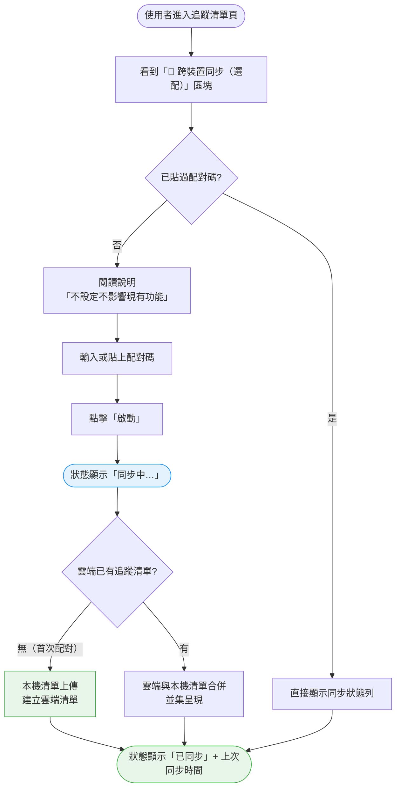
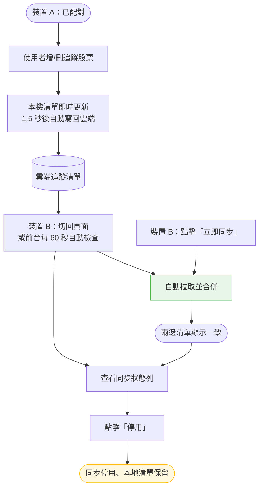
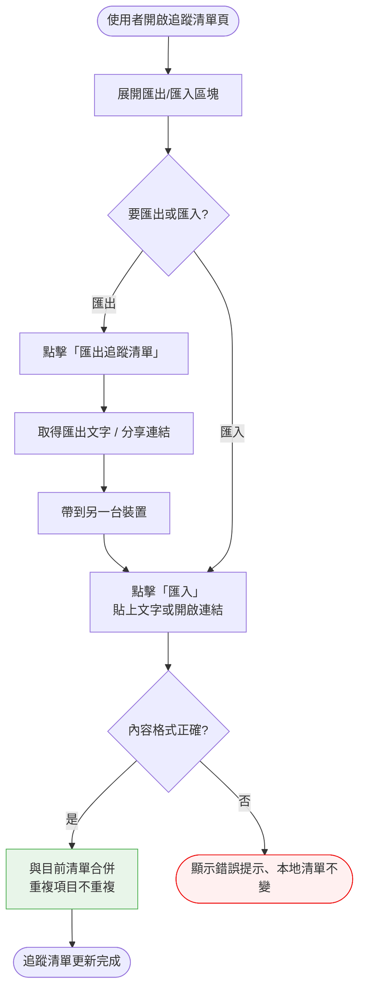
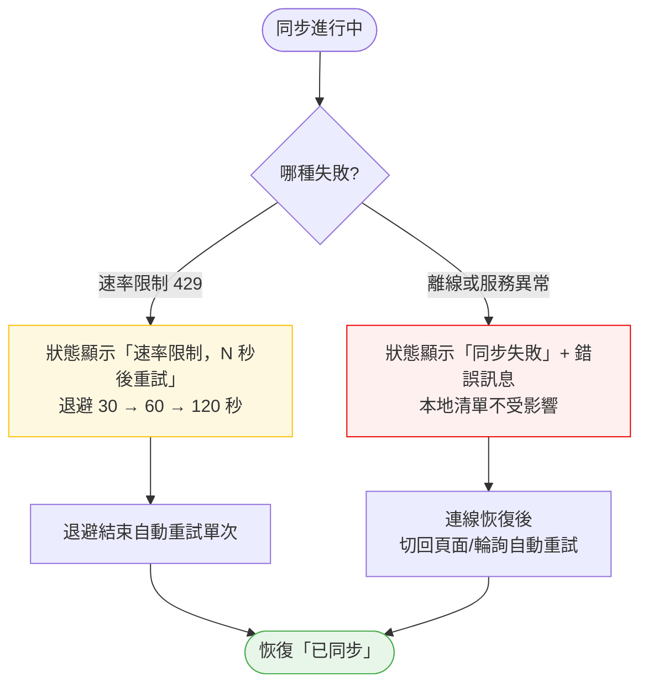

# Phase 9 跨裝置追蹤清單同步 — 操作流程設計

> **功能編號**：Phase 9
> **功能名稱**：跨裝置追蹤清單同步
> **核心價值**：讓使用者的追蹤清單可跨裝置自動同步（免登入、保持純靜態站），且完全不影響未啟用的裝置
> **前置文件**：`docs/development/phases/phase-9-跨裝置追蹤清單同步.md`、`docs/roadmaps/phases.md`（Phase 9 一節）、`docs/development/phases/phase-9-npoint-io-評估.md`

---

## 1. 功能概述

在追蹤清單頁新增「跨裝置同步（選配）」設定：使用者貼上配對碼後，追蹤清單會在配對的裝置之間自動同步；**未貼配對碼的裝置行為與現況完全一致**（localStorage 為主、offline-first）。同步失敗時本地資料永不消失，另有匯出/匯入作為手動備援。

---

## 2. 使用者與場景

### 使用者角色

| 角色 | 說明 |
|------|------|
| 一般使用者 | 訪客即可使用，無需登入；配對碼向網站擁有者索取（開通流程由擁有者執行） |
| 網站擁有者 | 產生/回收配對碼（非本功能 UI，由 README 流程執行） |

### 觸發入口

| 入口 | 位置 | 說明 |
|------|------|------|
| 🔄 同步設定區塊 | 追蹤清單頁（`/watchlist`） | 未配對時顯示「跨裝置同步（選配）」說明＋配對碼輸入框 |
| 🔄 同步狀態列 | 追蹤清單頁頂部 | 已配對時顯示狀態（同步中／已同步／失敗）＋上次同步時間 |
| 🔘 立即同步按鈕 | 同步狀態列 | 手動觸發一次同步 |
| 🔘 停用按鈕 | 同步狀態列 | 關閉同步，本地清單保留 |
| 📤 匯出／📥 匯入 | 追蹤清單頁備援區塊 | 手動備援：匯出成文字/分享連結，於另一裝置匯入合併 |

### 前置條件

- ☐ 想要同步的每台裝置皆需取得同一組配對碼（向擁有者索取）
- ☐ 配對碼為選配——未取得也能完整使用追蹤清單所有既有功能

### 使用情境

| 情境 | 說明 |
|------|------|
| 首次啟用 | 在手機貼上配對碼，與電腦的追蹤清單開始同步 |
| 未配對裝置 | 僅在一台裝置使用，不看設定區塊，行為與先前完全一樣 |
| 日常跨裝置同步 | 手機新增股票，回到電腦切回頁面即可看到 |
| 移除跨裝置傳播 | 手機刪除股票，電腦上的清單同步移除 |
| 離線使用 | 無網路時仍可增刪追蹤，恢復連線後自動合併 |
| 立即同步 | 不想等自動同步時，點「立即同步」手動確認 |
| 停用同步 | 不再需要跨裝置同步時，一鍵關閉，本地清單保留 |
| 備援逃生 | 自動同步長期不可用時，用匯出/匯入手動搬移清單 |

---

## 3. 操作流程圖

### 主流程 A：啟用同步（首次貼配對碼）

### 主流程 B：已配對裝置的日常同步

### 主流程 C：匯出／匯入備援（手動逃生門）

### 主流程 D：同步失敗與 429 退避顯示

---

## 4. 逐步互動說明

### 步驟 1：進入追蹤清單頁（未配對裝置）

| | 描述 |
|---|------|
| **觸發** | 使用者點擊導覽列「❤️ 追蹤清單」連結，進入 `/watchlist` |
| **操作前** | 使用者尚未貼過配對碼，追蹤清單儲存於本機瀏覽器 |
| **系統回應** | 顯示追蹤清單與「🔄 跨裝置同步（選配）」區塊，含說明文字與配對碼輸入框 |
| **操作後** | 追蹤清單所有既有操作（搜尋、加入、移除、切換模式）行為與先前完全一致 |
| **下一步** | 步驟 2：貼上配對碼啟用；或忽略此區塊繼續正常使用 |

### 步驟 2：貼上配對碼並啟動同步

| | 描述 |
|---|------|
| **觸發** | 使用者在配對碼輸入框貼上配對碼（向擁有者索取），點擊「啟動」 |
| **操作前** | 輸入框為空，區塊說明「不設定則完全不影響現有功能」 |
| **系統回應** | 檢查輸入內容為非空白，送出後狀態列顯示「同步中…」 |
| **操作後** | 該裝置已配對；配對碼記住於本機，重新整理頁面後仍維持已配對 |
| **下一步** | 步驟 3 或步驟 4：等待首次同步完成 |

### 步驟 3：首次配對——雲端尚無清單（上傳建立）

| | 描述 |
|---|------|
| **觸發** | 步驟 2 啟動後，雲端第一次被存取 |
| **操作前** | 狀態顯示「同步中…」，本機追蹤清單內容正常顯示 |
| **系統回應** | 雲端沒有資料 → 將本機追蹤清單上傳建立雲端清單 |
| **操作後** | 狀態變為「已同步」並顯示上次同步時間；本機清單內容不變 |
| **下一步** | 步驟 5：確認狀態；或步驟 6：開始日常跨裝置使用 |

### 步驟 4：首次配對——雲端已有清單（合併）

| | 描述 |
|---|------|
| **觸發** | 步驟 2 啟動後，雲端回傳另一台裝置既有的追蹤清單 |
| **操作前** | 狀態顯示「同步中…」 |
| **系統回應** | 雲端清單與本機清單合併：兩邊各自追蹤的股票全部保留（並集） |
| **操作後** | 本機清單顯示合併結果（包含另一台裝置追蹤的股票），狀態變為「已同步」 |
| **下一步** | 步驟 5：確認狀態與內容是否符合預期 |

### 步驟 5：檢視同步狀態

| | 描述 |
|---|------|
| **觸發** | 使用者查看追蹤清單頁頂部的同步狀態列 |
| **操作前** | 已配對，處於任一狀態 |
| **系統回應** | 顯示下列之一的狀態文字：同步中…／已同步／同步失敗；已同步時附「上次同步 HH:MM:SS」；失敗時附錯誤訊息 |
| **操作後** | 使用者可據此判斷同步是否正常 |
| **下一步** | 狀態正常 → 步驟 6；狀態失敗 → 步驟 9 或步驟 10 |

### 步驟 6：已配對裝置日常增刪追蹤（自動同步）

| | 描述 |
|---|------|
| **觸發** | 使用者在任一已配對裝置上點擊 ❤️ 加入追蹤，或移除追蹤 |
| **操作前** | 裝置已配對，狀態為「已同步」 |
| **系統回應** | 本機清單立即更新（❤️ 變色、徽章增減）；約 1.5 秒後自動寫回雲端，狀態短暫顯示「同步中…」後回到「已同步」 |
| **操作後** | 變更已寫入雲端；本機行為與未配對時完全相同（無感） |
| **下一步** | 步驟 7：在另一台裝置確認變更 |

### 步驟 7：另一裝置收到變更

| | 描述 |
|---|------|
| **觸發** | 使用者把另一台已配對裝置切回追蹤清單頁（或該裝置前台每 60 秒自動檢查） |
| **操作前** | 裝置 B 的追蹤清單停留在舊內容 |
| **系統回應** | 自動拉取雲端清單並合併；如他端新增 → 新增項目出現在清單；如他端移除 → 該項目從清單消失 |
| **操作後** | 兩台裝置追蹤清單內容一致 |
| **下一步** | 步驟 8：不想等待時手動立即同步 |

### 步驟 8：立即同步

| | 描述 |
|---|------|
| **觸發** | 使用者點擊狀態列的「立即同步」按鈕 |
| **操作前** | 已配對，狀態為「已同步」或「同步失敗」 |
| **系統回應** | 立即執行一次同步，狀態依序顯示「同步中…」→「已同步」；若仍失敗則顯示「同步失敗」與錯誤訊息 |
| **操作後** | 不需等待 60 秒輪詢即可確認最新狀態 |
| **下一步** | 步驟 11：持續失敗時考慮停用或使用匯出/匯入備援 |

### 步驟 9：離線操作與恢復

| | 描述 |
|---|------|
| **觸發** | 使用者在無網路（或雲端無法連線）狀態下增刪追蹤 |
| **操作前** | 已配對；連線正常時狀態為「已同步」 |
| **系統回應** | 本機增刪追蹤一切正常（localStorage 為主）；同步嘗試失敗，狀態列顯示「同步失敗」及錯誤訊息，但**本地清單不受影響** |
| **操作後** | 離線期間的變更完整保留在本機；恢復連線後（切回頁面、回到前景或輪詢）自動合併並回到「已同步」 |
| **下一步** | 步驟 10：若遇到速率限制則觀察退避顯示 |

### 步驟 10：429 速率限制退避顯示

| | 描述 |
|---|------|
| **觸發** | 雲端回傳速率限制（429）；例如頻繁切換頁面或短時間多次觸發同步 |
| **操作前** | 已配對，狀態為「同步中…」或「已同步」 |
| **系統回應** | 狀態列顯示「速率限制（429），N 秒後重試」（N 依 30 → 60 → 120 秒遞增）；此期間本機追蹤操作完全正常 |
| **操作後** | 退避時間結束後自動重試單次，成功則恢復「已同步」，失敗則延長退避 |
| **下一步** | 等待自動恢復；或點「立即同步」提早確認 |

### 步驟 11：停用同步

| | 描述 |
|---|------|
| **觸發** | 使用者點擊狀態列的「停用」按鈕 |
| **操作前** | 已配對，處於任一狀態 |
| **系統回應** | 停用確認後（依實作可能直接執行或需確認），狀態列變為「未啟用同步」，停止自動同步 |
| **操作後** | 本地追蹤清單完整保留；裝置回到與未配對時完全相同的行為 |
| **下一步** | 步驟 12：日後想再同步可重新貼配對碼 |

### 步驟 12：重新啟用同步

| | 描述 |
|---|------|
| **觸發** | 使用者再次在同步設定區塊貼上配對碼並點「啟動」 |
| **操作前** | 同步已停用，本地清單保留 |
| **系統回應** | 狀態列再次出現並顯示「同步中…」，隨後依雲端狀態進行合併（同步驟 3/4） |
| **操作後** | 該裝置重新納入跨裝置同步 |
| **下一步** | 步驟 5：確認同步狀態 |

### 步驟 13：匯出追蹤清單（備援）

| | 描述 |
|---|------|
| **觸發** | 使用者開啟追蹤清單頁的「匯出/匯入」區塊，點擊「匯出追蹤清單」 |
| **操作前** | 追蹤清單頁已載入（配對與否皆可使用） |
| **系統回應** | 產生匯出文字（或分享連結），提供複製/下載 |
| **操作後** | 使用者取得目前追蹤清單的可攜帶內容 |
| **下一步** | 步驟 14：在另一台裝置匯入 |

### 步驟 14：匯入追蹤清單（備援）

| | 描述 |
|---|------|
| **觸發** | 使用者在另一台裝置的「匯出/匯入」區塊，貼上匯出文字（或開啟分享連結）並點「匯入」 |
| **操作前** | 該裝置已有（或空白的）本地追蹤清單 |
| **系統回應** | 解析內容；格式正確則與目前清單合併（重複股票不重複加入），格式錯誤則顯示錯誤提示且**不更動本地清單** |
| **操作後** | 本地追蹤清單包含匯入的股票；如該裝置已配對，合併結果亦會自動同步上雲端 |
| **下一步** | 回到其他追蹤操作正常使用 |

---

## 5. 異常處理

| 異常情境 | 使用者看到的回饋 | 恢復路徑 |
|----------|-----------------|----------|
| 配對碼錯誤／無效 | 狀態顯示「同步失敗」與錯誤訊息；本地清單不受影響 | 確認配對碼正確後重新貼上；或向擁有者索取新配對碼 |
| 配對碼過期（TTL 90 天） | 同步持續失敗 | 向擁有者重新開通取得新配對碼 |
| 離線（無網路） | 本地增刪追蹤正常；狀態列顯示「同步失敗」，附錯誤訊息 | 恢復連線後自動重試（切回頁面／回到前景／輪詢），無需手動操作 |
| 429 速率限制 | 狀態列顯示「速率限制（429），N 秒後重試」；N 依 30→60→120 秒退避遞增 | 退避結束自動重試；期間本地操作完全正常 |
| 雲端服務停擺／改條款 | 同步失敗、無法恢復；本地追蹤清單一切正常 | 使用「匯出/匯入」備援手動搬移；等待服務恢復後自動回到同步 |
| 裝置 B 長時間未開啟 | 開啟後清單比裝置 A 舊 | 切回頁面即自動拉取合併，並集不遺失 |
| 同一支股票兩端同時編輯 | 合併後以最後變更的一方為準（單筆最後寫入勝出） | 無需處理；使用者檢視清單確認最終狀態 |
| 裝置 A 移除、裝置 B 未移除 | 墓碑合併後傳播到 B，B 的清單同步移除該支 | 無需處理 |
| localStorage 不可用（隱私模式） | 追蹤與同步等同未配對裝置；配對碼無法記住 | 改用一般瀏覽器視窗使用 |
| 配對碼外流 | 他人可能讀寫你的雲端清單（擁有者換 token 即回收） | 請擁有者產生新配對碼並重新貼上，舊碼立刻失效 |
| 匯入內容格式錯誤 | 顯示錯誤提示，本地清單不變 | 確認複製內容完整後重新匯入 |
| 匯入內容含重複股票 | 合併後不重複加入 | 無需處理 |

---

## 6. 邊界與限制

| 項目 | 說明 |
|------|------|
| 同步為選配 | 未貼配對碼的裝置不啟動任何同步，行為與現況 100% 一致 |
| 免登入 | 配對碼即身分；每個配對碼對應一份雲端清單，他人無法讀到你的清單 |
| 自動同步節奏 | 寫回：本地變更後約 1.5 秒；拉取：僅前台每 60 秒檢查一次＋切回頁面／回到前景時立即檢查（「切回頁面即可看到」） |
| 合併規則 | 單筆以最後變更者勝出；同日極端同時編輯僅最後寫入方生效（已接受） |
| 離線優先 | 本地資料永不因同步失敗而消失；同步失敗僅顯示狀態，不阻斷任何操作 |
| 速率上限 | 雲端額度 1,000 req/IP/hr；429 時指數退避 30→60→120 秒 |
| 配對碼時效 | TTL 90 天，過期需重新開通 |
| 匯出/匯入為手動備援 | 不走自動同步；僅搬移清單內容，不涉及配對狀態 |
| 追蹤數量上限 | 沿用既有建議（100 支內），不因開啟同步而改變 |
| 匯出內容 | 為目前追蹤中的股票（含 ETF／特別股），不包含已移除項目 |
| 同步狀態 | 可顯示：未啟用同步／已配對（尚未同步）／同步中…／已同步（附上次同步時間）／同步失敗（附錯誤訊息） |

---

## 7. 驗收檢查清單

### 啟用同步
- [ ] 未配對時，追蹤清單頁顯示「🔄 跨裝置同步（選配）」區塊與配對碼輸入框
- [ ] 未配對時，區塊說明「不設定則完全不影響現有功能」
- [ ] 配對碼輸入框為空時無法送出
- [ ] 貼上配對碼並點「啟動」後，狀態顯示「同步中…」
- [ ] 首次配對（雲端無資料）完成後狀態顯示「已同步」，本機清單內容不變
- [ ] 首次配對（雲端有資料）完成後，清單為本機與雲端並集
- [ ] 重新整理頁面後仍維持已配對狀態（配對碼被記住）

### 同步狀態顯示
- [ ] 已配對時狀態列顯示：同步中…／已同步／同步失敗 其中一種
- [ ] 已同步時顯示上次同步時間
- [ ] 同步失敗時顯示錯誤訊息
- [ ] 429 時顯示「速率限制（429），N 秒後重試」及退避秒數

### 跨裝置同步
- [ ] 兩台裝置各自貼上配對碼後，裝置 A 新增股票，裝置 B 切回頁面即可看到
- [ ] 裝置 A 移除股票，裝置 B 切回後該股票消失（墓碑傳播）
- [ ] 兩台各自新增不同股票 → 合併後並集不遺失
- [ ] 同一支股票兩端都變更 → 較新的一方勝出

### 立即同步
- [ ] 「立即同步」按鈕可直接觸發一次同步
- [ ] 點擊後狀態依序顯示「同步中…」→「已同步」

### 離線
- [ ] 離線時新增／移除追蹤皆正常
- [ ] 離線期間同步失敗不影響本地清單（raw 清單完整）
- [ ] 恢復連線後自動合併成功，不需重新貼配對碼

### 429 退避
- [ ] 429 發生時顯示退避訊息與秒數
- [ ] 退避期間本地追蹤操作正常
- [ ] 退避結束後自動恢復「已同步」

### 停用與重新啟用
- [ ] 點「停用」後狀態變為「未啟用同步」並停止自動同步
- [ ] 停用後本地追蹤清單保留
- [ ] 停用後可再次貼配對碼重新啟用

### 匯出／匯入備援
- [ ] 可匯出追蹤清單（取得文字或分享連結）
- [ ] 可在另一台裝置匯入並與本地清單合併
- [ ] 匯入格式錯誤時顯示錯誤提示且本地清單不變
- [ ] 匯入含重複股票時不重複加入

### 選配相容
- [ ] 未貼配對碼的裝置，所有既有追蹤操作行為與先前完全一致
- [ ] 未貼配對碼的裝置不發送任何同步請求
- [ ] 舊版追蹤資料（無新增欄位）可正常載入並沿用

---

## 📝 備註

- 本功能以「使用者操作」為中心：貼配對碼 → 看狀態 → 增刪自動同步 → 手動立即同步 → 停用；匯出/匯入是自動同步不可用時的手動逃生門
- 配對碼由網站擁有者以 README 流程開通後提供，一般使用者只需「貼上→啟動」
- 與 Phase 5a 的整合：❤️ 追蹤／移除、導覽列徽章、行事曆／列表顯示均不變；同步僅在背景補上「寫回→拉取→合併」